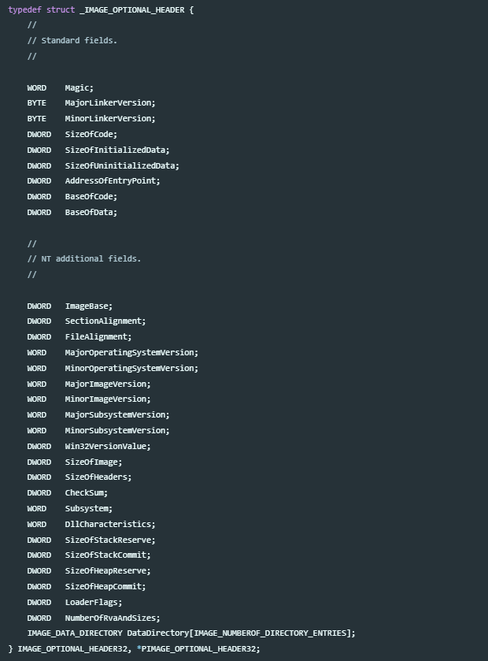
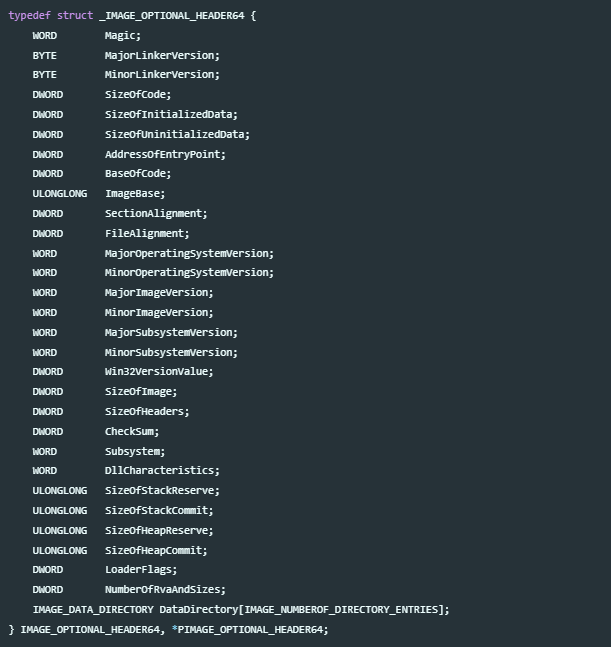

# PE FILE 
Task 2 - Tìm hiểu về PE FILE 

## PE file là gì ?
PE là viết tắt của Portable Executable

PE File Format là định dạng file riêng của Win32. Tất cả các file có thể thực thi trên Win32 đều sẽ có định dạng PE ( .exe, .dll, .com, .net, .obj, ...) ; ngoại trừ các tệp tin VxDs và .dll (16bit). NT's kernel mode driver cũng sử dụng định dạng tệp PE.

Một tệp có format PE file sẽ chứa cấu trúc thông tin cần thiết để OS Loader có thể load vào bộ nhớ và thực thi nó.
## Tại sao lại nên tìm hiểu

Đối với những người theo dịch ngược nói riêng và an ninh mạng nói chung thì việc nên tìm hiểu về cấu trúc PE File sẽ cực kỳ hữu ích , có thể liệt kê vài điều như sau : 
- hiểu cấu trúc chương trình được lưu,load, execute trên Windows
- phân tích mã độc, reverse, debugging
- recover file, phát hiện stealthy persistence
- Chống packer, anti-debug, thiết kế biện pháp bảo vệ, ...
- viết Tools dựa trên parsing PE
- ...
## Cấu trúc PE FILE
Một tệp có định dạng PE FILE sẽ có cấu trúc như sau :
- DOS Header
- DOS Stub
- NT Headers
  - PE signature
  - File Header
  - Optional Header
- Section Table


## I. DOS Header
Tất cả các file PE đều bắt đầu bằng DOS Header, vùng này chiếm `64 bytes` đầu tiên của file.

Nó được dùng trong trường hợp chương trình của bạn chạy trên nền DOS, do đó hệ điều hành DOS có thể nhận
biết nó như là một file thực thi hợp lệ và thi hành `DOS stub` , phần mà đã được lưu trữ trực tiếp ngay sau
DOS Header

`IMAGE_DOS_HEADER` : 

```c
typedef struct _IMAGE_DOS_HEADER {      // DOS .EXE header
    WORD   e_magic;                     // Magic number
    WORD   e_cblp;                      // Bytes on last page of file
    WORD   e_cp;                        // Pages in file
    WORD   e_crlc;                      // Relocations
    WORD   e_cparhdr;                   // Size of header in paragraphs
    WORD   e_minalloc;                  // Minimum extra paragraphs needed
    WORD   e_maxalloc;                  // Maximum extra paragraphs needed
    WORD   e_ss;                        // Initial (relative) SS value
    WORD   e_sp;                        // Initial SP value
    WORD   e_csum;                      // Checksum
    WORD   e_ip;                        // Initial IP value
    WORD   e_cs;                        // Initial (relative) CS value
    WORD   e_lfarlc;                    // File address of relocation table
    WORD   e_ovno;                      // Overlay number
    WORD   e_res[4];                    // Reserved words
    WORD   e_oemid;                     // OEM identifier (for e_oeminfo)
    WORD   e_oeminfo;                   // OEM information; e_oemid specific
    WORD   e_res2[10];                  // Reserved words
    LONG   e_lfanew;                    // File address of new exe header
  } IMAGE_DOS_HEADER, *PIMAGE_DOS_HEADER;
```
Trên đây là cấu trúc 64 bytes của DOS Header, nó cần thiết đối với trình Loader ở MS-DOS, nhưng đối với PE Loader ở Windows ta chỉ cần quan tâm đến `e_magic` và `e_lfanew`.

- `e_magic` : 2 byte đầu , mặc định là `0x5A4D`, viết ra ASCII thì là `MZ`. Nó chỉ đơn giản là magic number đánh dấu tệp thực thi MS-DOS
- `e_lfanew` : nằm ở offset `0x3C` , nó giữ offset của chỗ bắt đầu NT Headers, giúp cho Loader biết nơi nào để tìm file header

## II. DOS Stub
Hiểu đơn giản thì đây là 1 chương trình MS-DOS, chức năng đó là in ra 1 dòng thông báo rồi thoát nếu ta thực thi file ở trên MS-DOS.


Nhìn chung thì phần `DOS Header` và `DOS Stub` không cần phải quá để tâm lắm, trừ phần offset `0x3C` vì nó cho ta biết nơi bắt đầu NT Headers

## III. NT Headers
NT Headers (ở 1 số nguồn thì còn gọi phần này là PE Headers) với NT viết tắt của New Technology, nó được thiết kế để cho hệ điều hành Windows NT, nhằm phân biệt với header DOS cũ.

PE Header là thuật ngữ chung đại diện cho một cấu trúc được đặt tên là `IMAGE_NT_HEADERS` . Cấu
trúc này bao gồm những thông tin thiết yếu được sử dụng bởi loader. `IMAGE_NT_HEADERS` có 3
thành phần và được định nghĩa như sau (có 1 chút khác đối với bản 32-bit và 64-bit ): 

```c
typedef struct _IMAGE_NT_HEADERS64 {
    DWORD Signature;
    IMAGE_FILE_HEADER FileHeader;
    IMAGE_OPTIONAL_HEADER64 OptionalHeader;
} IMAGE_NT_HEADERS64, *PIMAGE_NT_HEADERS64;

typedef struct _IMAGE_NT_HEADERS {
    DWORD Signature;
    IMAGE_FILE_HEADER FileHeader;
    IMAGE_OPTIONAL_HEADER32 OptionalHeader;
} IMAGE_NT_HEADERS32, *PIMAGE_NT_HEADERS32;
```

Nhìn chung thì có 3 phần chính đó là :
- PE Signature
- File Header
- Optional Header

#### 1. PE Signature
Là một DWORD chứa những giá trị như sau 50h, 45h, 00h, 00h. Nếu viết thành ASCII thì sẽ là `PE\0\0`

Mục đích là nhận dạng bắt đầu của PE file. 

#### 2. File Header

Còn có thể gọi là `The COFF File Header`, bao gồm 20 bytes tiếp theo của PE file ,nó chứa thông tin về sơ đồ bố trí vật lý và những đặc tính của file.

Nó được định nghĩa là `IMAGE_FILE_HEADER` như sau :
```c
typedef struct _IMAGE_FILE_HEADER {
    WORD    Machine;
    WORD    NumberOfSections;
    DWORD   TimeDateStamp;
    DWORD   PointerToSymbolTable;
    DWORD   NumberOfSymbols;
    WORD    SizeOfOptionalHeader;
    WORD    Characteristics;
} IMAGE_FILE_HEADER, *PIMAGE_FILE_HEADER;
```

- `Machine`: chỉ kiến trúc CPU mà PE hướng tới (thường 0x14C cho i386 và 0x8664 cho AMD64).
- `NumberOfSections`: số lượng section trong file PE.
- `TimeDateStamp`: thời gian tạo file dưới dạng UNIX timestamp.
- `PointerToSymbolTable` & `NumberOfSymbols`: vị trí và số lượng entry của COFF symbol table (thường = 0 vì cơ chế debug này đã deprecated, thay bằng PDB).
- `SizeOfOptionalHeader`: kích thước của Optional Header để loader biết cần đọc bao nhiêu thông tin tiếp theo.
- `Characteristics`: các cờ mô tả thuộc tính file như executable, DLL, file hệ thống,…

Hầu hết những thành phần này không còn hữu ích đối với chúng ta nhưng chúng ta phải thay đổi thành
phần NumberOfSections nếu như chúng ta muốn thêm hoặc xóa bất kì sections nào trong một PE File

#### 3. Optional Header
Đây là phần có lẽ là quan trọng nhất trong PE File structure. Tại sao quan trọng nhất mà lại tên là **Optional** là bởi vì phần Header này trong các file object ( .obj , .lib) trung gian trong quá trình build không cần Header này. Nhưng đối với các file thực thi như .exe , .dll , .sys thì rất cần vì trình Loader cần các thông tin ở Header này để load thông tin vào memory.

Có 2 version cho Optional Header, với 32bit thì là `IMAGE_OPTIONAL_HEADER32` và 64bit thì là `IMAGE_OPTIONAL_HEADER64`. Chúng có 1 số sự khác nhau như sau:
- Về kích thước : `IMAGE_OPTIONAL_HEADER32` có 31 trường trong khi `IMAGE_OPTIONAL_HEADER64` chỉ có 30 trường. Ở struct 32bit có thêm trường `BaseOfData` dùng để giữ RVA đến beginning của data section.
- Data type : vài trường ở struct 32bit được định nghĩa là `DWORD` trong khi ở 64bit thì định nghĩa là `ULONGLONG`.

`IMAGE_OPTIONAL_HEADER32`



---

`IMAGE_OPTIONAL_HEADER64`



- Magic : 1 số nguyên để mô tả trạng thái của image
  - 0x10B : PE32
  - 0x20B : PE32+
  - 0x107 : ROM

- MajorLinkerVersion : The linker major version number
- MinorLinkerVersion : The linker minor version number
- SizeOfCode : kích thước của tất cả các phần code sections (.text)
- SizeOfInitializedData : Kích thước của tất cả phần dữ liệu đã được khởi tạo (.data)
- SizeOfUninitializedData : kích thước của tất cả phần dữ liệu chưa được khởi tạo (.bss)
- AddressOfEntryPoint : RVA đến EntryPoint của chương trình khi nó được nạp vào memory, trong trường hợp không có EntryPoint thì trường này phải để là 0.
- BaseOfCode : RVA đến điểm bắt đầu của code section khi nó được nạp vào memory
- BaseOfData (PE32 Only) : RVA đến điểm bắt đầu của data section khi mà file được load vào memory
- ImageBase: địa chỉ base ưa thích của file khi được nạp vào bộ nhớ (phải bội số 64K). Tuy nhiên do ASLR và các cơ chế bảo vệ, giá trị này thường không được dùng, nên loader chọn vùng nhớ khác và thực hiện `relocation` để cập nhật các địa chỉ tham chiếu, dựa trên thông tin trong section `.reloc`
- SectionAlignment : Căn chỉnh các sections khi mà chúng được load vào memory (tính bằng byte). Địa chỉ của các sections được load trong memory phải là bội số của giá trị này. Giá trị này luôn phải `>=` FileAlignment. Thông thường thì giá trị mặc định của trường này sẽ là kích thước trang bộ nhớ
- FileAlignment : Căn chỉnh các sections, nhưng mà là các dữ liệu thô ở trên disk. Nếu mà kích thước thực tế của 1 phần nhỏ hơn giá trị FileAlignment thì phần còn lại sẽ được đệm bằng 0x00 cho đủ. Nếu mà SectionAlignment `nhỏ hơn` kích thước trang bộ nhớ thì giá trị của FileAlignment buộc phải bằng với SectionAlignment.
- MajorOperatingSystemVersion --- MinorOperatingSystemVersion --- MajorImageVersion --- MinorImageVersion --- MajorSubsystemVersion --- MinorSubsystemVersion : Chỉ định số phiên bản của từng phần
- Win32VersionValue : nên để là 0 
- SizeOfImage : kích thước của toàn bộ image (cả headers và sections) trong bộ nhớ khi nó được load vào, phải là bội số của SectionAlignment
- SizeOfHeaders : Kích thước của toàn bộ header của PE (DOS header + NT headers + section table), sau khi căn chỉnh theo FileAlignment. Tức là chỉ phần header, không bao gồm các section. Phải là bội số của FileAlignment
- CheckSum : checksum của image file, nó dùng để xác thực image lúc runtime
- Subsystem : chỉ định windows subsystem nếu có để chạy image.
- DLLCharacteristics : Dùng để xác định các đặc điểm của image file, cái này có thể tham khảo ở Docs của Microsoft
- SizeOfStackReserve --- SizeOfStackCommit --- SizeOfHeapReserve --- SizeOfHeapCommit : Chỉ định kích thước của các phần tương ứng
- LoaderFlags : nên để là 0
- NumberOfRvaAndSizes : kích thước của mảng `DataDirectory`
- DataDirectory : 1 mảng có cấu trúc `IMAGE_DATA_DIRECTORY` , chúng ta sẽ tìm hiểu ngay sau đây

### **DataDirectory**

Là trường cuối cùng trong Optional Header, nó được định nghĩa như sau :
```c++
#define IMAGE_NUMBEROF_DIRECTORY_ENTRIES    16


typedef struct _IMAGE_DATA_DIRECTORY {
    DWORD   VirtualAddress;
    DWORD   Size;
} IMAGE_DATA_DIRECTORY, *PIMAGE_DATA_DIRECTORY;
```

**Các ENTRIES bao gồm :**

```c++
#define IMAGE_DIRECTORY_ENTRY_EXPORT          0   // Export Directory
#define IMAGE_DIRECTORY_ENTRY_IMPORT          1   // Import Directory
#define IMAGE_DIRECTORY_ENTRY_RESOURCE        2   // Resource Directory
#define IMAGE_DIRECTORY_ENTRY_EXCEPTION       3   // Exception Directory
#define IMAGE_DIRECTORY_ENTRY_SECURITY        4   // Security Directory
#define IMAGE_DIRECTORY_ENTRY_BASERELOC       5   // Base Relocation Table
#define IMAGE_DIRECTORY_ENTRY_DEBUG           6   // Debug Directory
//      IMAGE_DIRECTORY_ENTRY_COPYRIGHT       7   // (X86 usage)
#define IMAGE_DIRECTORY_ENTRY_ARCHITECTURE    7   // Architecture Specific Data
#define IMAGE_DIRECTORY_ENTRY_GLOBALPTR       8   // RVA of GP
#define IMAGE_DIRECTORY_ENTRY_TLS             9   // TLS Directory
#define IMAGE_DIRECTORY_ENTRY_LOAD_CONFIG    10   // Load Configuration Directory
#define IMAGE_DIRECTORY_ENTRY_BOUND_IMPORT   11   // Bound Import Directory in headers
#define IMAGE_DIRECTORY_ENTRY_IAT            12   // Import Address Table
#define IMAGE_DIRECTORY_ENTRY_DELAY_IMPORT   13   // Delay Load Import Descriptors
#define IMAGE_DIRECTORY_ENTRY_COM_DESCRIPTOR 14   // COM Runtime descriptor
```

Nhìn vào cấu trúc của struct là ta biết rằng với mỗi ENTRY thì nó sẽ cho ta biết được RVA đến điểm điểm start và kèm theo đó là kích thước của DataDirectory đó.


## IV. Section Table

Section Table là thành phần tiếp theo ngay sau PE Header.Nó là một mảng của những cấu trúc
`IMAGE_SECTION_HEADER`, mỗi phần tử sẽ chứa thông tin về một section trong PE File.

`IMAGE_SECTION_HEADER` được định nghĩa như sau :

```c++
typedef struct _IMAGE_SECTION_HEADER {
    BYTE    Name[IMAGE_SIZEOF_SHORT_NAME];
    union {
            DWORD   PhysicalAddress;
            DWORD   VirtualSize;
    } Misc;
    DWORD   VirtualAddress;
    DWORD   SizeOfRawData;
    DWORD   PointerToRawData;
    DWORD   PointerToRelocations;
    DWORD   PointerToLinenumbers;
    WORD    NumberOfRelocations;
    WORD    NumberOfLinenumbers;
    DWORD   Characteristics;
} IMAGE_SECTION_HEADER, *PIMAGE_SECTION_HEADER;
```

- Name : Với `IMAGE_SIZEOF_SHORT_NAME` được define là 8 thì mảng tên UTF-8 này không được dài quá 8 ký tự 
- PhysicalAddress/VirtualSize : Kích thước thật sự của section's data theo bytes. Nó có thể nhỏ hơn kích
thước của section trên đĩa (SizeOfRawData) và sẽ là những gì mà trình loader định rõ ví trí trong bộ nhớ
cho section này.
- VirtualAddress : RVA của từng section. Trình PE loader sẽ phân tích và sử dụng giá trị trong trường này khi
nó ánh xạ section vào trong bộ nhớ. Ví dụ nếu giá trị trong trường này là 1000h và PE File được nạp tại
điạ chỉ 400000h , thì section sẽ được nạp tại địa chỉ là 401000h
- SizeOfRawData : Kích thước của section‟s data trong file ở image, được làm tròn lên bội số tiếp theo của FileAlignment bởi trình biên dịch .
    - **NOTE** : `SizeOfRawData` và `VirtualSize` có thể khác nhau bởi yêu cầu căn chỉnh trong file và cách cấp phát bộ nhớ khi chạy.
      - ví dụ 1 - SizeOfRawData > VirtualSize :
        - Section thực sự chỉ có 300 bytes dữ liệu code, nhưng do FileAlignment = 512 bytes nên phải padding thêm cho đủ nên khi này `SizeOfRawData` = 512 bytes còn `VirtualSize` = 300 bytes
      -  ví dụ 2 - VirtualSize > SizeOfRawData :
         -  Trên disk chỉ có 200bytes chứ dữ liệu khởi tạo, nhưng còn các dữ liệu ở .bss khi load lên thì memory cần cấp phát thành 1000bytes để chứa chúng chẳng hạn. Thì lúc này `SizeOfRawData` = 200 bytes còn `VirtualSize` = 1000 bytes
 -  PointerToRawData : thành phần này thực sự rất hữu dụng bởi vì nó là offset từ vị trí bắt đầu của file cho tới phần section's data. Nếu nó có giá trị là 0 , thì section‟s data không được chứa trong file và sẽ không bị bó buộc vào thời gian nạp (load time). Trình PE Loader sẽ sử dụng giá trị trong trường này để tìm kiếm phần data trong section là ở đâu trong file.
 -  PointerToRelocations : Trỏ tới phần đầu của các mục Reloc entries cho section. Đối với file thực thi thì đựac thành 0 hoặc nếu không có reloc
 -  PointerToLineNumbers : Trỏ đến phần đầu của mục số dòng của COFF, nhưng đặt thành 0 vì thông tin debug COFF không còn được dùng nữa
 -  NumberOfRelocations : số lượng reloc entries cho section. Set thành 0 cho file thực thi
 -  NumberOfLinenumbers : số lượng dòng cho section, set thành 0 vì COFF không dùng nữa
 -  Characteristics : Các cờ mô tả các đặc điểm của section. xem docs của microsoft để biết thêm về các đặc điểm

---

**Dưới đây sẽ là các sections đặc biệt cho biết mục đích của chúng :** 
- .bss : Dữ liệu chưa khởi tạo
- .cormeta : Siêu dữ liệu CLR cho biết rằng tệp đối tượng chứa mã được quản lý 
- .data : Dữ liệu đã khởi tạo
- .debug$F : Thông tin gỡ lỗi FPO được tạo (chỉ object và kiến trúc x86 , hiện đã lỗi thời) 
- .debug$P : Các loại debug được biên dịch sẵn (chỉ object)
- .debug$S : Debug symbols (chỉ object)
-  .debug$T : Debug types (chỉ object)
-  .drective : Linker options
-  .edata : bảng Export 
-  .idata : bảng Import
-  .idlsym : SEH đã đăng ký (chỉ image) để hỗ trợ các thuộc tính IDL
-  .pdata : thông tin ngoại lệ
-  .rdata : Dữ liệu được khởi tạo, chỉ đọc 
-  .reloc : image reloc
-  .rsrc : thư mục tài nguyên
-  .sbss : dữ liệu chưa khởi tạo, dành cho biến nhỏ / biến truy cập nhanh qua thanh ghi GP
-  .srdata : dữ liệu chỉ đọc, dành cho biến truy cập nhanh qua GP.
-  .sxdata : dành cho x86 dùng để lưu thông tin về exception handler đã đăng ký
-  .text : mã thực thi
-  .tls | .tls$  : Thread Local Storage, cung cấp dung lượng lưu trữ cho mọi luồng thực thi của chương trình
-  .vsdata : chứa initialized data nhỏ được truy cập theo GP-relative, thường xuất hiện trên một số kiến trúc nhúng/đặc thù như ARM, SH4, Thumb
-  .xdata : Thông tin ngoại lệ 


Hiểu đơn giản thì khi loader đọc từng 40bytes của mỗi section header, thì nó sẽ xác định được vị trí, size, các thông tin quan trọng của phần section data nằm ở dưới. Và mỗi section khác nhau thì lại có các cấu trúc khác nhau. Chẳng hạn với `.idata` thì có struct `IMAGE_IMPORT_DESCRIPTOR` ; `edata` thì có `IMAGE_EXPORT_DIRECTORY` ; `.text` thì mà `machine code` ; `.data` thì là `raw data` ; ...v.v...


---
---
---
END
